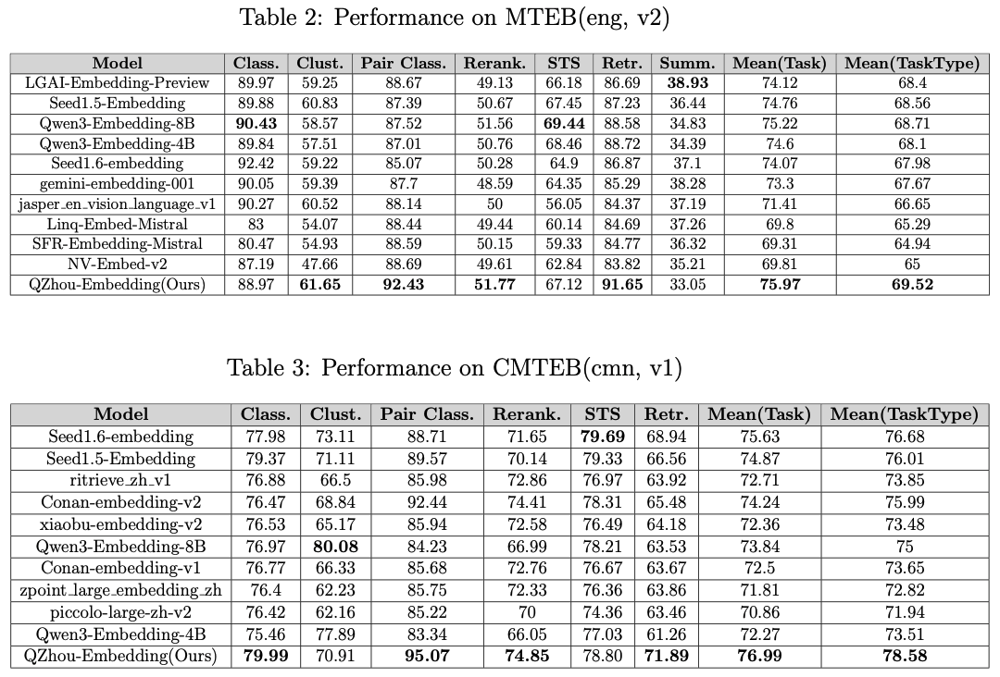

# QZhou-Embedding
<div align="center">
</img>
</div>


## Introduction
We present <a href="https://huggingface.co/Kingsoft-LLM/QZhou-Embedding">QZhou-Embedding</a> (called "Qingzhou Embedding"), a general-purpose contextual text embedding model with exceptional text representation capabilities. Built upon the <a href="https://huggingface.co/Qwen/Qwen2.5-7B-Instruct">Qwen2.5-7B-Instruct</a> foundation model, we designed a unified multi-task framework and developed a data synthesis pipeline leveraging LLM API, effectively improving the diversity and quality of training data, further enhancing the model's generalization and text representation capabilities. Additionally, we employ a two-stage training strategy, comprising initial retrieval-focused training followed by full-task fine-tuning, enabling the embedding model to extend its capabilities based on robust retrieval performance. Our model achieves state-of-the-art results on the MTEB and CMTEB benchmarks, ranking first on both leaderboards(August 27, 2025).

**<span style="font-size: 18px; color:green">Latest Updates:</span>**<br>
**1. Our technical report has now been released. Welcome your feedback！** ​​Link:​​ <a href="https://arxiv.org/abs/2508.21632">[QZhou-Embedding](https://arxiv.org/abs/2508.21632)</a><br>
**2. We have added support for vLLM.**
## Basic Features

- Powerful text embedding capabilities；
- Long context: up to 8k context length；
- 7B parameter size

## Model Refactoring
For the Qwen base model, we implemented the following modifications:
1. Replaced causal attention with bidirectional attention and constructed a new QZhouModel module based on Qwen2Model;
2. Modified the tokenizer's padding_side to "left".

## MTEB/CMTEB Results
</img>


## Usage
### Completely reproduce the benchmark results
We provide detailed parameters and environment configurations so that you can run results that are completely consistent with the mteb leaderboard on your own machine, including configurations such as environment dependencies and model arguments.
#### Requirements
- Python: 3.10.12
- Sentence Transformers: 3.4.1
- Transformers: 4.51.1
- PyTorch: 2.7.1
- Accelerate: 1.3.0
- Datasets: 3.2.0
- Tokenizers: 0.21.2
- mteb: 1.38.30
- vllm: 0.10.1.1

#### Transformers model load arguments
torch_dtype=torch.bfloat16<br>
attn_implementation='sdpa'<br>
**NOTE：** The leaderboard evaluation results were obtained using "sdpa" mode. Other modes ('eager', 'flash_attention_2') may vary in results, but still keep the overall performance consistent.
#### Instruction Adding Rules
Details can be found on our <a href="https://github.com/Kingsoft-LLM/QZhou-Embedding">GitHub</a>.
#### Evaluation code usage
Find our benchmark evaluation code on <a href="https://github.com/Kingsoft-LLM/QZhou-Embedding">GitHub</a>. The mteb benchmark script is **run_mteb_all_v2.py**, and the cmteb benchmark script is **run_cmteb_all.py**. Run the following command:
```bash
POOLING_MODE=mean
normalize=true
use_instruction=true
export TOKENIZERS_PARALLELISM=true

model_name_or_path=<model dir>

python3 ./run_cmteb_all.py \
    --model_name_or_path ${model_name_or_path}  \
    --pooling_mode ${POOLING_MODE} \
    --normalize ${normalize} \
    --use_instruction ${use_instruction} \
    --output_dir <output dir>

python3 ./run_mteb_all_v2.py \
    --model_name_or_path ${model_name_or_path}  \
    --pooling_mode ${POOLING_MODE} \
    --normalize ${normalize} \
    --use_instruction ${use_instruction} \
    --output_dir <output dir>
```
The "<>" should be replaced with your actual setting.<br>
This is a general script that can be used to evaluate other huggingface embedding models, but you need to ensure that the pooling and other configurations are correct.

### Sentence-transformers

```py
from sentence_transformers import SentenceTransformer

model = SentenceTransformer(
    "Kingsoft-LLM/QZhou-Embedding",
    model_kwargs={"device_map": "cuda", "trust_remote_code": True},
    tokenizer_kwargs={"padding_side": "left", "trust_remote_code": True},
    trust_remote_code=True
)

queries = [
    "What is photosynthesis?",
    "Who invented the telephone?",
]
documents = [
    "Photosynthesis is the process by which green plants use sunlight, carbon dioxide, and water to produce glucose and oxygen. This biochemical reaction occurs in chloroplasts.",
    "Alexander Graham Bell is credited with inventing the first practical telephone in 1876, receiving US patent number 174,465 for his device."
]

query_embeddings = model.encode(queries, prompt_name="query", normalize_embeddings=True)
document_embeddings = model.encode(documents, normalize_embeddings=True)

similarity = model.similarity(query_embeddings, document_embeddings)
```

### Huggingface Transformers

```py
import torch
import torch.nn.functional as F

from torch import Tensor
from transformers import AutoTokenizer, AutoModel


def mean_pool(last_hidden_states: Tensor,
                 attention_mask: Tensor) -> Tensor:

    seq_lengths = attention_mask.sum(dim=-1)
    return torch.stack(
                [
                    last_hidden_states[i, -length:, :].sum(dim=0) / length
                    for i, length in enumerate(seq_lengths)
                ],
                dim=0,
            )


def get_detailed_instruct(task_description: str, query: str) -> str:
    return f'Instruct: {task_description}\nQuery:{query}'

task = 'Given a web search query, retrieve relevant passages that answer the query'

queries = [
    get_detailed_instruct(task, 'What is photosynthesis?'),
    get_detailed_instruct(task, 'Who invented the telephone?')
]

documents = [
    "Photosynthesis is the process by which green plants use sunlight, carbon dioxide, and water to produce glucose and oxygen. This biochemical reaction occurs in chloroplasts.",
    "Alexander Graham Bell is credited with inventing the first practical telephone in 1876, receiving US patent number 174,465 for his device."
]

input_texts = queries + documents

tokenizer = AutoTokenizer.from_pretrained('Kingsoft-LLM/QZhou-Embedding', padding_side='left', trust_remote_code=True)
model = AutoModel.from_pretrained('Kingsoft-LLM/QZhou-Embedding', trust_remote_code=True, device_map='cuda')

batch_dict = tokenizer(
    input_texts,
    padding=True,
    truncation=True,
    max_length=8192,
    return_tensors="pt",
)
batch_dict.to(model.device)
outputs = model(**batch_dict)
embeddings = mean_pool(outputs.last_hidden_state, batch_dict['attention_mask'])

embeddings = F.normalize(embeddings, p=2, dim=1)
scores = (embeddings[:2] @ embeddings[2:].T)
```
### vLLM
```py
from vllm import LLM
import torch.nn.functional as F

def get_detailed_instruct(task_description: str, query: str) -> str:
    return f'Instruct: {task_description}\nQuery:{query}'

task = 'Given a web search query, retrieve relevant passages that answer the query'
queries = [
    get_detailed_instruct(task, 'What is photosynthesis?'),
    get_detailed_instruct(task, 'Who invented the telephone?')
]
documents = [
    "Photosynthesis is the process by which green plants use sunlight, carbon dioxide, and water to produce glucose and oxygen. This biochemical reaction occurs in chloroplasts.",
    "Alexander Graham Bell is credited with inventing the first practical telephone in 1876, receiving US patent number 174,465 for his device."
]

input_texts = queries + documents
model = LLM(model="Kingsoft-LLM/QZhou-Embedding")
outputs = model.embed(input_texts)
scores = [F.normalize(torch.tensor(x.outputs.embedding), p=2, dim=0) for x in outputs]
```

### FAQs
**1. Does the model support MRL?**<br>
The model currently does not support MRL in this release due to observed performance degradation.<br>
**2. Why not build upon the Qwen3 series models?**<br>
Our initial research experiments commenced prior to the release of Qwen3. To maintain our experimental consistency, we retained the original base model throughout the study😊😊😊. While we subsequently conducted first-stage (retrieval) training with Qwen3, the performance after 32k steps showed no significant improvement over Qwen2.5, leading to discontinuation of further development with this architecture.

### Citation
If you find our work worth citing, please use the following citation:<br>
**Technical Report:**
```
@misc{yu2025qzhouembeddingtechnicalreport,
      title={QZhou-Embedding Technical Report}, 
      author={Peng Yu and En Xu and Bin Chen and Haibiao Chen and Yinfei Xu},
      year={2025},
      eprint={2508.21632},
      archivePrefix={arXiv},
      primaryClass={cs.CL},
      url={https://arxiv.org/abs/2508.21632}, 
}
```

**Qwen2.5-7B-Instruct:**
```
@misc{qwen2.5,
    title = {Qwen2.5: A Party of Foundation Models},
    url = {https://qwenlm.github.io/blog/qwen2.5/},
    author = {Qwen Team},
    month = {September},
    year = {2024}
}
```
