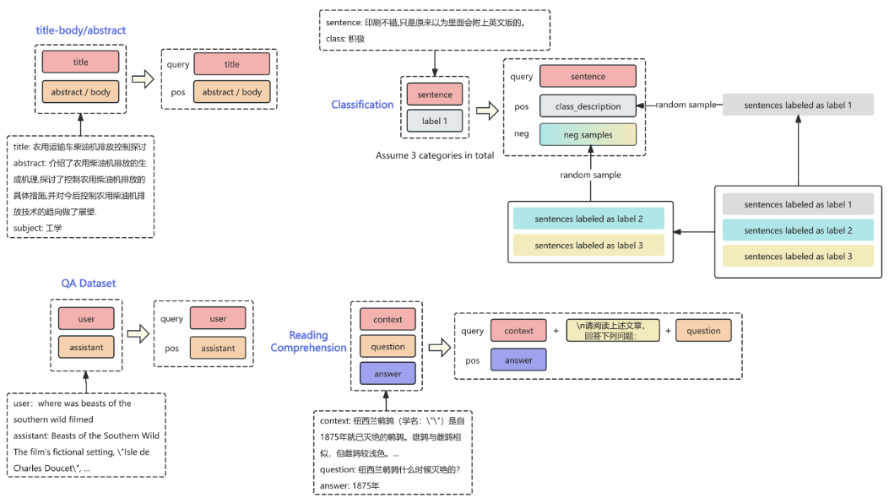
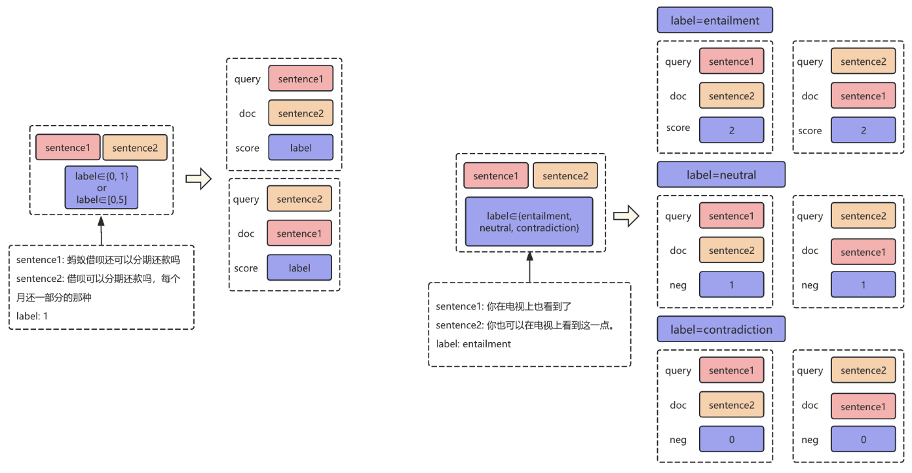
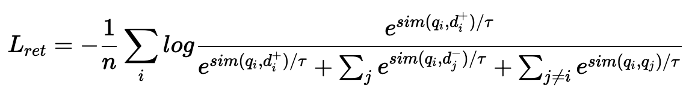
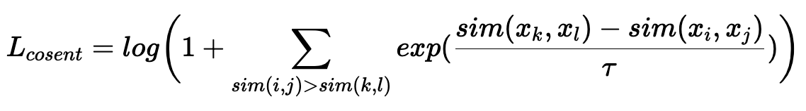
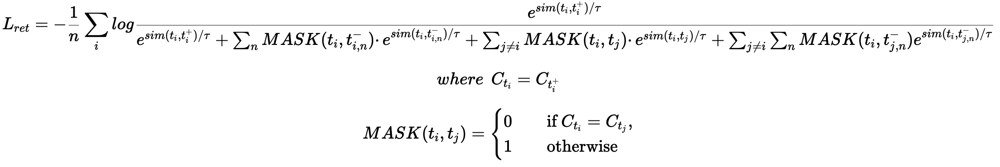
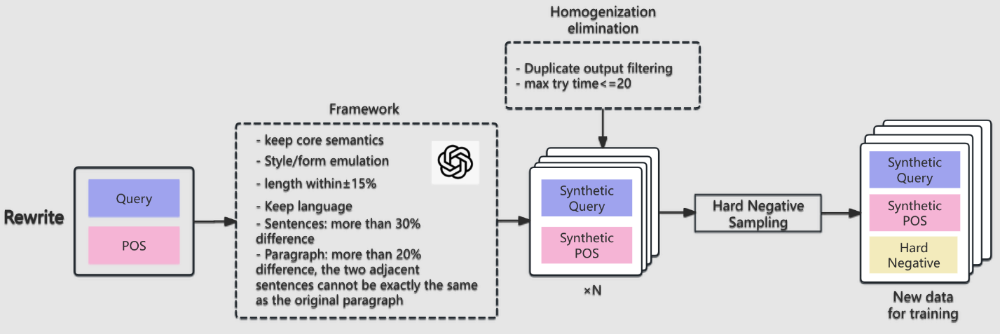
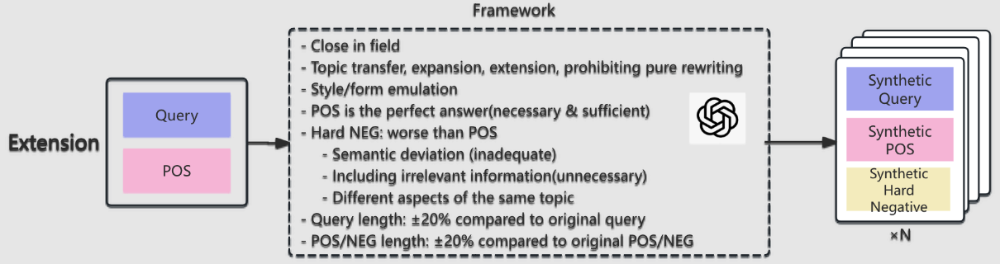
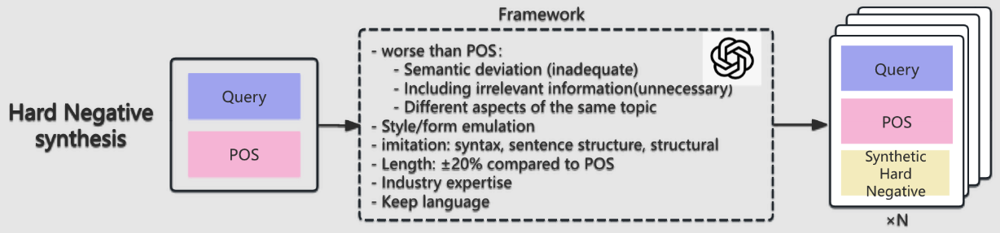
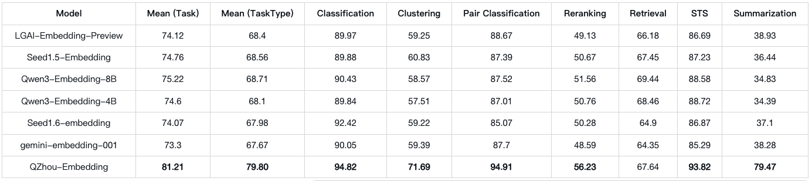
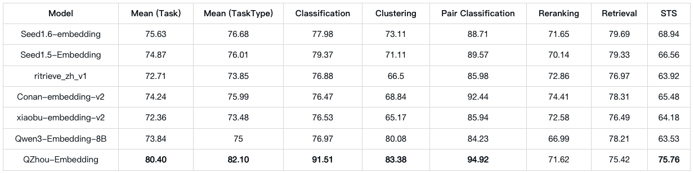

# QZhou-Embedding
<div align="center">
</img>
</div>

## 简介
我们发布<a href="https://huggingface.co/Kingsoft-LLM/QZhou-Embedding">QZhou-Embedding</a>(轻舟Embedding😈😈😈)，面向通用领域的文本向量表示大模型，擅长各种文本嵌入（检索、重排、句对相似度、分类）任务。我们基于Qwen2Model改造模型逻辑，将因果注意力机制修改为双向注意力，使每个token都能捕获到全局上下文语义，新模块命名为QZhouModel。得益于基础模型在海量文本上预训练获得的通用语言能力，QZhou-Embedding能够获得更加强大的文本嵌入表示。QZhou-Embedding使用百万量级高质量开源检索数据，以及500万+高质量合成数据（改写、扩展两大合成技术）进行持续训练。我们通过第一阶段检索训练为模型提供query-doc语义匹配能力基础，第二阶段的STS、聚类等多维度能力训练帮助模型在各种场景下持续突破。QZhou-Embedding的模型参数为7B，具备最大8k的长文本向量嵌入能力。在mteb/cmteb评测基准上取得均值全榜最高，各任务指标方面，聚类、句对分类、重排、STS任务指标均值全榜最高的效果。

## QZhou-Embedding基本特点

- 强大的文本嵌入能力；
- 长上下文：最大支持8k；
- 参数量7B


## 技术介绍
### 统一任务建模框架
将文本嵌入目标统一为三大问题建模优化，提出统一的训练数据结构化方案和对应的训练机制---可融入大部分开源数据作为检索训练集，可结构化数据如下：
- 检索
  - title-body
  - title-abstract
  - 问答类数据
  - 阅读理解
  - ...

- STS
  - 文本对+{true, false}、{yes, no}标签
  - 文本对+分数（如0.2、3.1、4.8等）
  - NLI数据：文本对+{'entailment', 'neutral', 'contradiction'}标签

- CLS
  - 句子+类标签

<div align="center"></img></div>
<div align="center"></img></div>

### 训练目标

- 检索：使用InfoNCE对比学习loss函数，效仿gte/qwen3-embedding的改进增加q-q对负样例惩罚<br>
<div align="center"></img></div>

- STS：使用Cosent loss：
<div align="center"></img></div>

- CLS：同检索一致使用InfoNCE loss，但In-Batch Negative时由于同类冲突概率大，使用mask机制掩盖不同样本共享的负样例中的同类样本。
<div align="center"></img></div>
其中${C_{t_i}}$表示样本${t_i}$的类标签，n是单条数据的负样本数。

### 特征增强数据合成技术
在当今大模型语言及创作能力强大的背景下，我们充分利用了大模型API设计数据合成技术。针对训练集中存在数据少、话题狭隘等问题，我们提出改写、扩展合成技术；同时为增强训练时的负样例难度，我们在现有基于强大Embedding实现难负例采样的基础上，使用基于大模型的难负样例合成技术。几种技术介绍如下：
<div align="center"></img></div>
<div align="center"></img></div>
<div align="center"></img></div>

想要获取更多信息（如评测脚本、指令格式等），欢迎访问我们的Github：<a href="https://github.com/Kingsoft-LLM/QZhou-Embedding">GitHub</a>

## 评测结果
### mteb榜单明细
<div align="center"></img></div>

### cmteb榜单明细
<div align="center"></img></div>

## 使用指南
### 完全复现榜单结果
我们提供详细的参数、环境配置，以便能够在自己的机器上完全跑出跟榜单一致的结果，包括环境依赖、模型参数等配置。
#### 环境依赖版本
- Python: 3.10.12
- Sentence Transformers: 3.4.1
- Transformers: 4.51.1
- PyTorch: 2.7.1
- Accelerate: 1.3.0
- Datasets: 3.2.0
- Tokenizers: 0.21.2
- mteb: 1.38.30
#### 模型加载参数
torch_dtype=torch.bfloat16<br>
attn_implementation='sdpa'<br>
**注：** 榜单结果使用了sdpa模式，其他模式('eager'、 'flash_attention_2')存在偏差，但不影响整体表现
#### 指令添加规则
在我们的<a href="https://github.com/Kingsoft-LLM/QZhou-Embedding">GitHub</a>上可以找到。
#### 评测代码使用
在<a href="https://github.com/Kingsoft-LLM/QZhou-Embedding">GitHub</a>上找到我们的评测代码，其中mteb评测脚本是**run_mteb_all_v2.py**，cmteb评测脚本是**run_cmteb_all.py**，运行如下命令：
```
POOLING_MODE=mean
normalize=true
use_instruction=true
export TOKENIZERS_PARALLELISM=true

model_name_or_path=模型目录位置

python3 ./run_cmteb_all.py \
    --model_name_or_path ${model_name_or_path}  \
    --pooling_mode ${POOLING_MODE} \
    --normalize ${normalize} \
    --use_instruction ${use_instruction} \
    --output_dir 结果输出路径

python3 ./run_mteb_all_v2.py \
    --model_name_or_path ${model_name_or_path}  \
    --pooling_mode ${POOLING_MODE} \
    --normalize ${normalize} \
    --use_instruction ${use_instruction} \
    --output_dir 结果输出路径
```
这是一套通用脚本，可以用于其他huggingface embedding模型的评测，但需要确保pooling等配置正确。

### Sentence Transformers

```
from sentence_transformers import SentenceTransformer

model = SentenceTransformer("Kingsoft-LLM/QZhou-Embedding")

model = SentenceTransformer(
    "Kingsoft-LLM/QZhou-Embedding",
    model_kwargs={"device_map": "cuda", "trust_remote_code": True},
    tokenizer_kwargs={"padding_side": "left", "trust_remote_code": True},
    trust_remote_code=True
)

queries = [
    "What is photosynthesis?",
    "Who invented the telephone?",
]
documents = [
    "Photosynthesis is the process by which green plants use sunlight, carbon dioxide, and water to produce glucose and oxygen. This biochemical reaction occurs in chloroplasts.",
    "Alexander Graham Bell is credited with inventing the first practical telephone in 1876, receiving US patent number 174,465 for his device."
]

query_embeddings = model.encode(queries, prompt_name="query", normalize_embeddings=True)
document_embeddings = model.encode(documents, normalize_embeddings=True)

similarity = model.similarity(query_embeddings, document_embeddings)
```

### Huggingface Transformers

```
import torch
import torch.nn.functional as F

from torch import Tensor
from transformers import AutoTokenizer, AutoModel


def mean_pool(last_hidden_states: Tensor,
                 attention_mask: Tensor) -> Tensor:

    seq_lengths = attention_mask.sum(dim=-1)
    return torch.stack(
                [
                    last_hidden_states[i, -length:, :].sum(dim=0) / length
                    for i, length in enumerate(seq_lengths)
                ],
                dim=0,
            )


def get_detailed_instruct(task_description: str, query: str) -> str:
    return f'Instruct: {task_description}\nQuery:{query}'

task = 'Given a web search query, retrieve relevant passages that answer the query'

queries = [
    get_detailed_instruct(task, 'What is photosynthesis?'),
    get_detailed_instruct(task, 'Who invented the telephone?')
]

documents = [
    "Photosynthesis is the process by which green plants use sunlight, carbon dioxide, and water to produce glucose and oxygen. This biochemical reaction occurs in chloroplasts.",
    "Alexander Graham Bell is credited with inventing the first practical telephone in 1876, receiving US patent number 174,465 for his device."
]

input_texts = queries + documents

tokenizer = AutoTokenizer.from_pretrained('Kingsoft-LLM/QZhou-Embedding', padding_side='left', trust_remote_code=True)
model = AutoModel.from_pretrained('Kingsoft-LLM/QZhou-Embedding', trust_remote_code=True, device_map='cuda')

batch_dict = tokenizer(
    input_texts,
    padding=True,
    truncation=True,
    max_length=8192,
    return_tensors="pt",
)
batch_dict.to(model.device)
outputs = model(**batch_dict)
embeddings = mean_pool(outputs.last_hidden_state, batch_dict['attention_mask'])

embeddings = F.normalize(embeddings, p=2, dim=1)
scores = (embeddings[:2] @ embeddings[2:].T)
```
